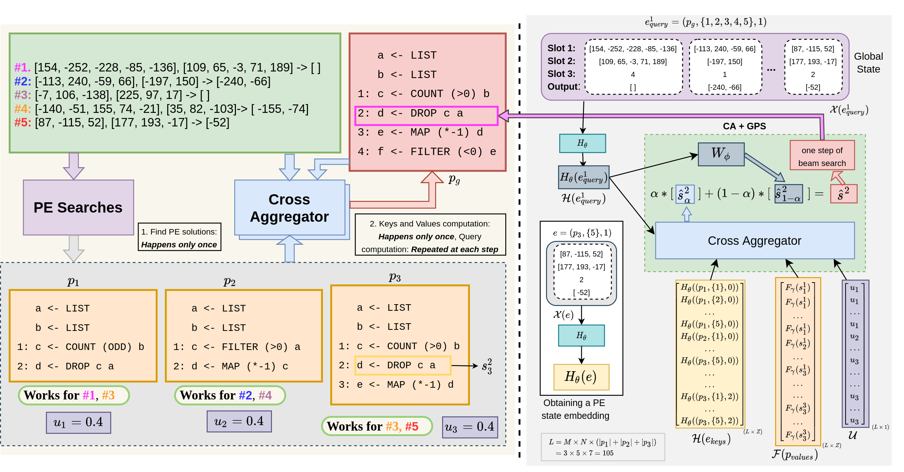

## Learning to Combine Per-Example Solutions for Neural Program Synthesis
Disha Shrivastava, Hugo Larochelle, Daniel Tarlow

This repository contains implementation and data for our work [Learning to Combine Per-Example Solutions for Neural Program Synthesis](). A block diagram of our approach can be found below. For more details, refer to the paper.

 

## Dependencies
* python 3.8.5
* pytorch 1.4.0
* pathos
* tqdm
* pandas

## Data

### Downloading data used in the paper
* Download the data from [here](https://drive.google.com/file/d/1gjeHn0tXhm0XJgNb0-XI53Pf6VFiaBLJ/view?usp=sharing). Extract the data and place in the root folder. It contains two subfolders for E1 and E2, each containing the 30 test splits and training and validation data for learning GPS model and PE model.

### Generating training and validation programs
#### Setting E1: Train programs up to length 4 and test programs of length = 4
`python -m scripts.gen_train_programs --num_train=100000 --train_output_path=data/E1/trainval_dataset --max_train_len=4`
#### Setting E2: Train programs up to length 12 and test programs of length = 5, 8, 10, 12, 14
`python -m scripts.gen_train_programs --num_train=100000 --train_output_path=data/E2/trainval_dataset --max_train_len=12`

The training and validation datasets for training the GPS model are stored as train_dataset_gps and val_dataset_gps, and the corresponding datasets for training the PE model as train_dataset_pe and val_dataset_pe, respectively. Note that since the generation process is random, the generated programs and examples may differ each time the script is run.

### Generating test programs
We load the corresponding trainval dataset for each setting and then generate 30 splits of 500 test programs for both E1 and E2. For example, to generate split x of test programs of length y in E2, we use the command below.

`python -m scripts.gen_test_programs --num_candidates=60000 --num_test=500 --test_len y --train_programs_path=data/E2/trainval_dataset --test_output_path=data/E2/test_splits/len_y/split_x`

### Generating aggregator instances
We generate aggregator instances for training and validation data for both E1 and E2 separately corresponding to the three timeouts (see Appendix B.2 of the paper for details). Note that we need a trained PE model for this stage.

`python -m scripts.gen_agg_instances --input_data_path=data/E2/train_dataset --peps_timeout_type=rand --output_data_path=data/E2/agg_train_dataset_rand --max_program_len=12`

Use max_program_len = 4 for E1 and 12 for E2. After generating the aggregator instances, we can have the two inclusion conditions (agg_inp in the script) as well as the two modes of discovering PE solutions (see Appendix B.2). This is done using the script `scripts/preprocess_agg_instances.py`. An example usage is:

`python -m scripts.preprocess_agg_instances --input_path=data/E2/agg_train_dataset_rand --agg_inp=tot --include_perfect_PE_programs`

After both these steps, we will have 12 datasets (3 x 2 X 2) to train the CA module and 12 datasets for validation.

## Training

### Trained_Models for both E1 and E2 (can be downloaded from [here](https://drive.google.com/file/d/1ldTyBfZdpIZZ4fUYiu5INmQb__KwWRZb/view?usp=sharing))

### Training the GPS and PE models
Train GPS and PE models by running `scripts/train.py`. Depending on what model is being trained, change the training and validation data paths, batch_size and model_output_path in file params.py (see Appendix C.1 of the paper for hyperparameter values used in our experiments).

### Training the Cross Aggregator
Use `scripts/train_aggregator.py` to train the CA module using the training aggregator instances and to select appropriate hyperparameters using the validation aggregator instances (see Appendix C.2 and Appendix C.3 of the paper for hyperparameter values used in our experiments). Vary the `att_type` argument in the script to train either a N-PEPS or N-PEPS+U model. Similarly, vary the `key_type` argument to train with different variants of the key.

## Inference
Use `scripts/solve_problems.py` for doing inference on the test splits. Vary the `agg_type` argument in the script to run inference on different methods. Based on the method, vary the `alpha` and `peps_timeout` values (see Appendix C.4 of paper for details of hyperparameters used in our experiments). The result file has a json dictionary line for each program predicted. The dictionary contains the predicted program and some details about the search, like the amount of time the search took and the final beam size.

## Analyzing results
Use `scripts/analyze_solution.py` to collate the results from different test splits and different runs into a single csv file.

## Notes
* We have build upon PCCoder implementation available at https://github.com/amitz25/PCCoder (MIT License)